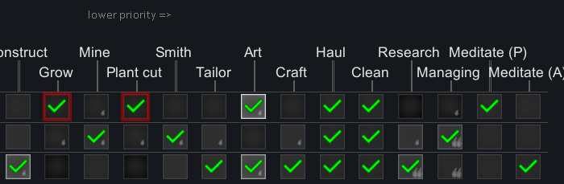

# MeditateAsWorkType

This is a mod for the game RimWorld by Ludeon Studios.

The mod allows you to configure Meditation in the Work tab instead of the Schedule tab.

We're on Steam: https://steamcommunity.com/sharedfiles/filedetails/?id=2324532667

# Table of Contents

* [Introduction](#introduction)
* [Incompatibilities](#incompatibilities)

# Introduction

The mod allows you to configure Meditation in the Work tab instead of the Schedule tab.

You'll find two new columns in the "Work" tab:

* Meditate (P) - meditate for psyfocus, per the configured target threshold on the pawn's widget.
* Meditate (A) - meditate to grow anima grass, as a tribal pawn, even without a psylink.

This lets you do things, like, have the pawn also be a Doctor, and they will automatically ping back and forth between doctoring and meditating, which is impossible using the Schedule tab method.

# Incompatibilities

"There's an option in Common Sense called "Pawns will only meditate as much as they need" which conflicts with this mod. For anyone having issues who happens to have that mod, just disable the bottom option in the top category of Common Sense." -- Jiopaba
